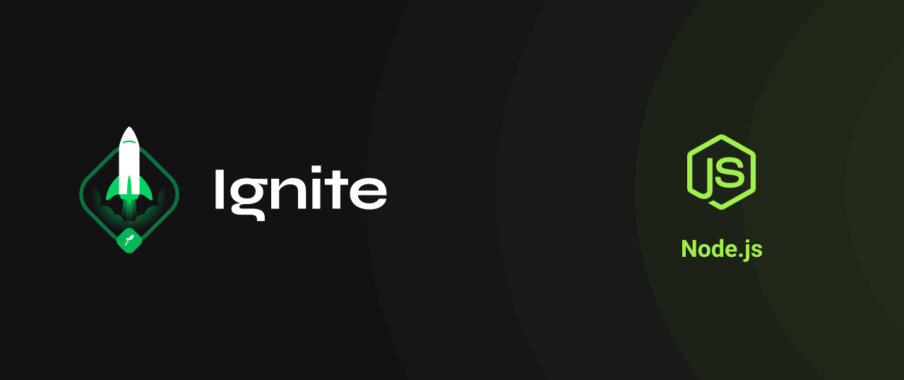

#  Chapter IV - Desafio 01: Unit Test :rocket: :purple_heart:

## :golf: Objective

In this challenge, you must create integration tests for a ready-made application using everything you've learned about testing so far.

- Unit Test
- Integration Test
- Database

## command to create database

docker run --name nodejs-learn-desafio07 -e POSTGRES_DB=fin_api -e POSTGRES_PASSWORD=docker -e POSTGRES_USER=postgres -p 5432:5432 -d postgres
